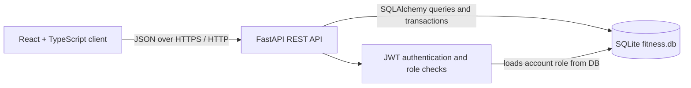
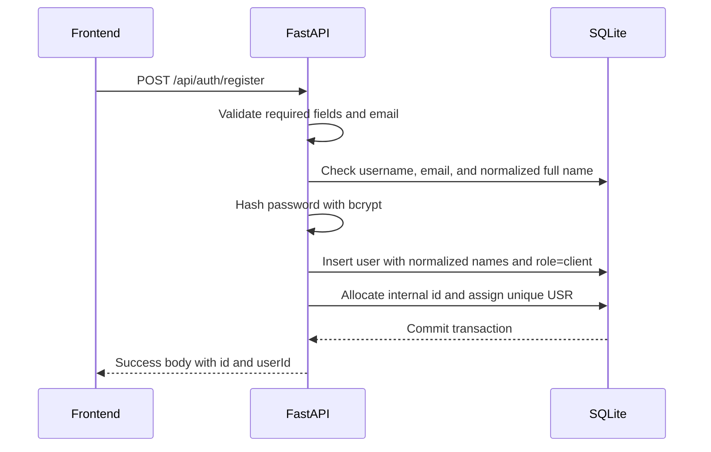

# FitChallenge Software Design Document

## 1. Scope

FitChallenge is a fitness activity tracker. Clients register, record an activity
for a date, receive normalized points, and use a personal dashboard and global
leaderboard. A separately provisioned administrator can view client-only
aggregate data, client accounts, rankings, and activity history.

The system uses a React/TypeScript frontend, FastAPI backend, and persistent
SQLite database.

## 2. System Architecture and Data Flow



The frontend uses Axios to attach the JWT bearer token to authenticated
requests. The API is the source of truth for registration, roles, activity
validation, scoring, and authorization. The browser may redirect users to an
appropriate route for usability, but administrator access is always checked by
the backend before protected data is returned.

### Registration flow



Public registration never accepts a role input. It always creates `role =
client`. The first administrator is created at deployment/startup from
`INITIAL_ADMIN_*` environment values; its password is hashed before it is
stored.

### Activity ingestion flow

```mermaid
sequenceDiagram
    participant F as Client dashboard/form
    participant A as FastAPI
    participant D as SQLite

    F->>A: POST /api/activities with activity type, value, date
    A->>A: Verify JWT and role=client
    A->>A: Validate type, format, range, and positive value
    A->>D: Check duplicate activity
    A->>D: Insert workout; unique constraint rejects concurrent duplicates
    A->>A: Calculate floored points
    A-->>F: Activity ID, activity, metric value, points, date
```

The frontend prevents choosing future dates. The selected activity date is
stored with a neutral `12:00:00` time solely to represent the date; the admin
history UI intentionally displays the date only.

## 3. Database Schema and Data Model

SQLite is file-backed at `backend/fitness.db`. The active data model is below.
`PK` means primary key, `FK` means foreign key, and `UQ` means a database-level
uniqueness guarantee.

| Table | Fields and types | Keys and purpose |
| --- | --- | --- |
| `users` | `id INTEGER`, `user_id TEXT`, `username TEXT`, `email TEXT`, `hashed_password TEXT`, `first_name TEXT`, `last_name TEXT`, `normalized_first_name TEXT`, `normalized_last_name TEXT`, `role TEXT`, `created_at DATETIME` | `id` is PK. `user_id` is UQ and is the external ID (`USR001`). `username` and `email` are UQ. The normalized-name pair is UQ. `role` is `client` or `admin`. Passwords are bcrypt hashes only. |
| `workouts` | `id INTEGER`, `user_id INTEGER`, `activity_type TEXT`, `distance FLOAT`, `duration FLOAT`, `steps INTEGER`, `recorded_at DATETIME`, `created_at DATETIME` | `id` is PK; `user_id` is FK to `users.id`. Only the metric applicable to an activity is populated. The tuple (`user_id`, `activity_type`, `recorded_at`) is UQ. |

There is no persisted leaderboard table. The leaderboard is a derived read
model: workout points are summed per **client** user whenever the leaderboard
endpoint is requested. This eliminates synchronization drift between activity
records and leaderboard totals.

Older local databases can contain an `is_admin` compatibility column. Migration
uses it once to map existing accounts to `role`, and all current authorization
uses only `role`.

### Duplicate-user enforcement

1. The API first checks `username`, `email`, and the normalized first-name and
   last-name pair so it can return a clear validation error.
2. The `users` table independently enforces uniqueness for `username`, `email`,
   public `user_id`, and the pair (`normalized_first_name`,
   `normalized_last_name`).
3. During registration, the backend collapses extra whitespace and case-folds
   the supplied names before storing them in `normalized_first_name` and
   `normalized_last_name`. If simultaneous duplicate registrations pass the
   initial checks, the database unique constraint rejects one transaction; the
   backend rolls it back and returns `409 Conflict`.
4. The public identifier is temporarily assigned a unique pending value while
   SQLite allocates `users.id`, then changed to `USR` plus the padded numeric ID
   before the transaction commits. A unique index enforces the final value.

## 4. API Specifications

All JSON requests use `Content-Type: application/json`. Protected endpoints
require `Authorization: Bearer <JWT>`.

### Authentication and account APIs

| Route | Request | Success response | Validation and errors |
| --- | --- | --- | --- |
| `POST /api/auth/register` | `{ username, email, password, first_name, last_name }` | User object including numeric `id`, public `userId` such as `USR005`, profile fields, and `role: "client"` | Rejects duplicate username/email/full name (`400` or `409`). Role is not accepted from the request. |
| `POST /api/auth/login` | `{ username, password }` | `{ access_token, token_type, user_id, username }` | Invalid credentials return `401`. |
| `GET /api/users/me` | JWT | Current user with `id`, `userId`, profile and backend-sourced `role` | Missing/invalid JWT returns `401`. |
| `GET /api/users/{user_id}` | Path ID | Client user profile | Admin accounts return `404` from this client-facing route. |

After login, the frontend obtains `/api/users/me`; the returned role selects the
client or administrator dashboard. This is not a security boundary: the API
checks the same role from the database for every protected admin request.

### Activity APIs

| Route | Request or response | Rules |
| --- | --- | --- |
| `POST /api/activities` | `{ activity_type, value, activity_date }` | Client role required. Returns `{ id, activity_type, value, points, recorded_at }`. Duplicate submission returns `409`. |
| `GET /api/activities` | Client's own activity array | Client role required. Admin accounts receive `403`. |
| `GET /api/leaderboard` | Ranked client totals | Excludes admin accounts. No JWT is required for the global read model. |
| `GET /api/leaderboard/trend` | Current client's date/rank series | Client role required. |

Allowed activity types are `running`, `walking`, `cycling`, `swimming`, `gym`,
and `daily_steps`. Values must be positive. Swimming, gym, and daily steps must
be whole numbers. Reasonable maximums are enforced: running 200 km, walking 100
km, cycling 500 km, swimming/gym 1440 minutes, and daily steps 100,000.

### Administrator APIs

| Route | Response | Authorization |
| --- | --- | --- |
| `GET /api/admin/overview` | Client totals, seven-day user-growth series, recent client activity | `role = admin` required; otherwise `403`. |
| `GET /api/admin/users` | Client accounts with activity count and points | Admin only; admins are excluded from the result. |
| `GET /api/admin/activities` | All client activity entries | Admin only; admins are excluded from the result. |

The admin dashboard's **View All** link routes to `/admin/activities`, which
uses the final endpoint. The backend returns `403 Forbidden` for a valid client
token at any `/api/admin/*` endpoint.

## 5. Scoring and Normalization Logic

Points are calculated when an activity is read or returned. The same function is
used by activity responses, dashboards, and leaderboard aggregation.

| Activity | Input metric | Rule | Points |
| --- | --- | --- | --- |
| Running | km | Floor fractional result | `floor(km × 100)` |
| Walking | km | Floor fractional result | `floor(km × 50)` |
| Cycling | km | Floor fractional result | `floor(km × 25)` |
| Swimming | minutes | Count completed whole minutes only | `floor(minutes) × 15` |
| Gym | minutes | Count completed whole minutes only | `floor(minutes) × 5` |
| Daily Steps | steps | Count completed 100-step blocks only | `floor(steps / 100)` |

Examples:

- `1.55 km` walking → `floor(77.5)` = **77 points**.
- `1 minute 55 seconds` gym input is validated as whole minutes; `1` minute →
  **5 points**.
- `399` daily steps → `floor(399 / 100)` = **3 points**.

### Ranking algorithm

For every client, valid activity points are cumulatively summed. Totals are
sorted by descending points, then by internal user ID for deterministic output.
Competition ranking is applied: equal totals receive the same rank and the next
rank skips positions (`1, 2, 2, 4`). The client leaderboard refreshes on its
existing 15-second frontend interval; each refresh fetches a newly derived
server total. The rank trend recomputes historical cumulative rank by date from
saved client activities.

## 6. Frontend Architecture and Visualizations

### Component and route breakdown

| Area | Main frontend pieces | Behavior |
| --- | --- | --- |
| Public pages | `HomePage`, `LoginPage`, `RegisterPage` | Registration/login; role is never sent by the client. |
| Client workspace | `ReferenceDashboardPage`, `ValidatedRecordActivityPage`, `ReferenceLeaderboardPage` | Dashboard, activity entry, and leaderboard routes are wrapped in `ClientRoute`. |
| Admin workspace | `AdminDashboardPage`, `AdminUsersPage`, `AdminLeaderboardPage`, `AdminActivityHistoryPage` | Routes are wrapped in `AdminRoute`; the sidebar changes by role. |
| Shared infrastructure | `authStore`, `apiClient`, `Navbar`, `Sidebar`, route guards | Stores user/role and JWT locally, attaches the bearer token, and handles presentation routing. |

The personal dashboard derives today's points, streak, calendar marks, selected
date history, personal-best values, activity volume, and sport preference from
the client's `/api/activities` data. It displays an empty state rather than a
chart when there is no activity.

The activity volume chart is an SVG line chart whose selected y-axis is steps,
distance, or duration over seven days. The sport-preference chart is an SVG pie
chart; hover reveals the selected sport and percentage. The leaderboard and
ranking trend use SVG-based visualizations and API-derived ranked totals.

## 7. Trade-offs and Edge Cases

| Decision / edge case | Handling and rationale |
| --- | --- |
| SQLite instead of a server database | Simple persistent local deployment. SQLAlchemy isolates the persistence code, allowing a later move to PostgreSQL if multi-process production scale is required. |
| Duplicate registration requests | Application checks give user-friendly messages; the unique normalized-name pair on `users` protects concurrent requests. |
| Duplicate activity requests | Application pre-check catches ordinary repeats; the unique workout tuple protects simultaneous identical requests. |
| Invalid or missing metric | Frontend shows required/format errors; FastAPI validates type, positivity, whole-number-only metrics, and maxima. |
| Zero or negative metric | A clear validation dialog is shown in the form and API rejects the request. |
| Future activity date | The date input has a maximum of today, preventing upcoming dates in the UI. |
| Decimal scoring | Distance points are floored at the final points calculation; duration and step rules floor completed units/blocks. |
| No activity | Client dashboard shows zero-valued summary data and no-chart empty states. |
| Tied totals | Competition ranking preserves ties as `1, 2, 2, 4`. |
| Admin account visibility | Admin records are filtered from client lists, leaderboard calculation, client activity APIs, admin user list, and admin activity list. |
| Frontend route tampering | `AdminRoute` improves navigation, but FastAPI role checks are decisive. A client token receives `403` from admin APIs. |
| Administrator password | Provisioning hashes the password with bcrypt immediately. No plaintext password is written to SQLite or returned by an API. |

## 8. Deployment Notes

For a new database, set these values in `backend/.env` before starting the API:

```dotenv
INITIAL_ADMIN_USERNAME=admin
INITIAL_ADMIN_PASSWORD=choose-a-strong-secret
INITIAL_ADMIN_EMAIL=admin@example.com
INITIAL_ADMIN_FIRST_NAME=Admin
INITIAL_ADMIN_LAST_NAME=User
```

Do not commit a real password. On startup, if no admin exists, the backend
creates the configured administrator directly. If no initial credentials are
provided and no admin exists, startup fails intentionally rather than allowing
a public registration to become an administrator.
